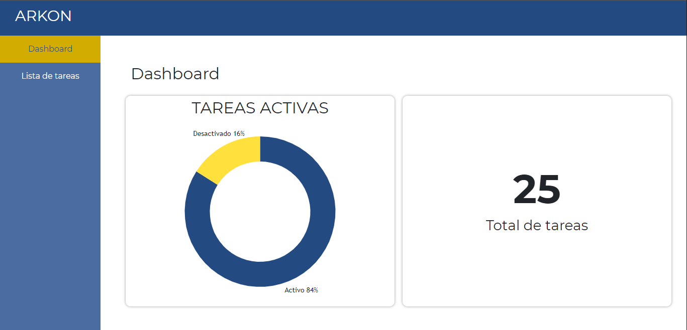
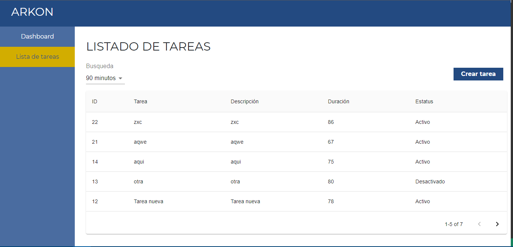
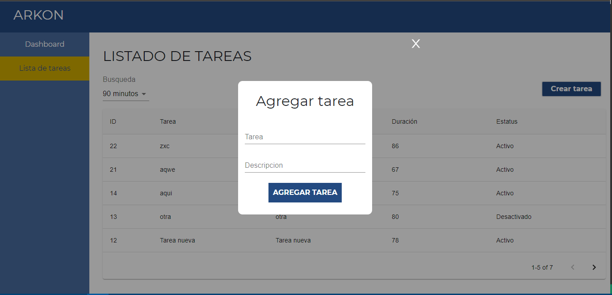
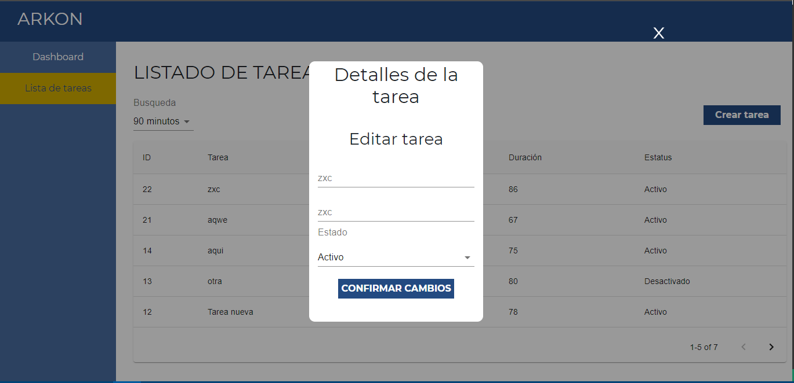

# Prueba para vacante en arkon

### Instalar modulos

  npm install
  
### Ejecutar entorno de desarrollo

  npm start
  
## Documentacion

### Dashboard

### Lista de tareas

### Añadir tarea

### Modificar tarea

Para accesar a los detalles de la tarea, es necesario hacer click en la tarea especifica para que abra el pop up y asi poder modificar los datos de la tarea

